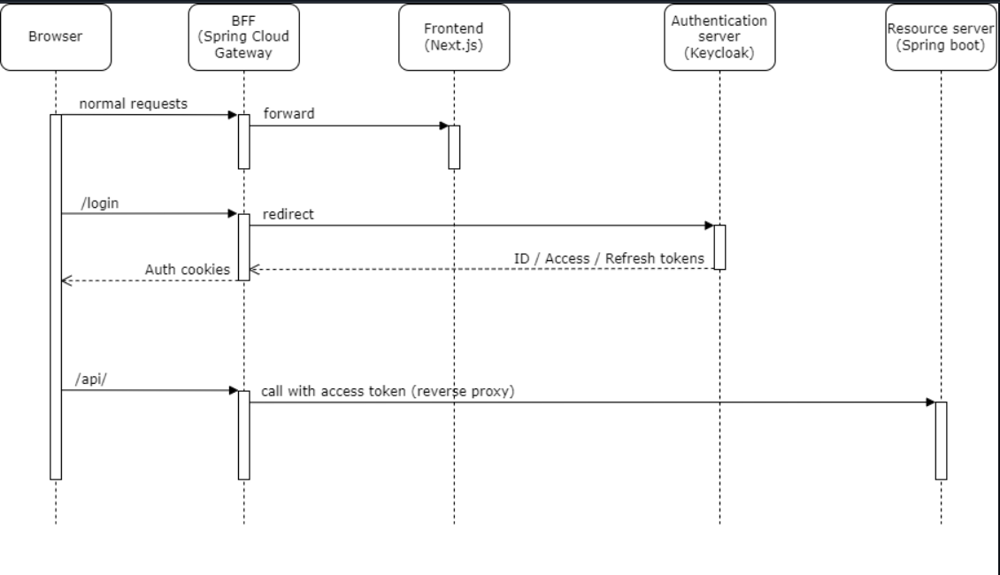
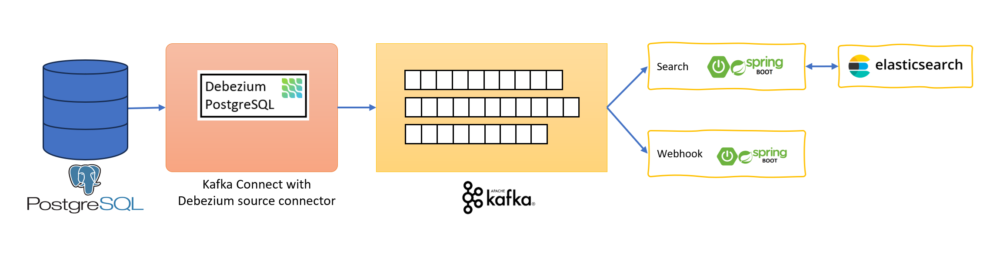

# Welcome to CongThanhApp

## Tentative technologies and frameworks
- Python 3.12, Jupiter Notebook
- Java 21, Spring boot 3.4.0
- Go 1.23.4
- Node 20
- React 19, Next.js 15
- PostgreSQL, MySQL, MongoDB
- Redis
- Nginx
- Keycloak
- Kafka
- RabbitMQ
- Elasticsearch, Logstash, Kibana
- K8s
- Jenkins, GitHub Actions
- SonarCloud
- OpenTelemetry
- Grafana, Loki, Prometheus, Tempo
- Amazon Web Service (VPC, EC2, S3, etc)

## Project structure
```
congthanhapp/
├── ai/
│   ├── chatbot/
│   ├── face-recognition/
│   └── resume-screening/
│
├── backend/
│   ├── app/   
│   │    ├── ecommerce/  
│   │    │      ├── k8s/ 
│   │    │      ├── service/ 
│   │    │      └── terraform/
│   │    │
│   │    └── management/
│   │
│   └── auth/
│
├── data-analysis/
│   ├── data-crawling/ 
│   ├── data-preprocessing/ 
│   └── visualazation
│
├── front-end/
│   ├── ecommerce/ 
│   └── management/
│
├── machine-learning/
│   ├── product-recommend/ 
│   └── sales-forecast-predictation/
│
├── services/
│   ├── api-gateway/
│   ├── bff
│   ├── ci-cd/ 
│   ├── service-config/
│   └── service-discovery/
│
├── docker-compose.yaml
├── Dockerfile 
└── README.md
```

Technologies used in this software:
## [AI](https://github.com/pdcthanh112/MyDream/tree/main/ai)


## [Backend](https://github.com/pdcthanh112/MyDream/tree/main/backend)

Using microservices architecture, include 2 modules: module Auth using NodeJS (NestJS) + MySQL, module
Management: using microservices architecture, each service is a spring boot app, including services: user-service,
product-service, inventory-service, cart-service, order-service, payment-service, etc.

Each service uses CQRS architecture (Axon framework) with PostgreSQL on the command side and MongoDB
on the query side, data is synchronized between the two databases using message broken mechanism with
RabbitMQ, in parallel is the process of calling the command sides of related services to write data using Apache
Kafka. Services call each other internally via gRPC

Using Go for api-gateway, service-discovery and load-balancing (Round-robin algorithm) and Redis for caching

Use the Saga pattern to manage and enforce data consistency, and exceptions for transaction processing flows.

### Authentication and Authorization
In this app, I use SameSite cookies and tokens together with the backend for frontend (BFF) pattern with Spring Cloud Gateway. We also use Keycloak as the authentication provider.



The BFF acts as a reverse proxy for both Next.js and resource servers behind it. The authentication between browser and BFF is done by cookies. The BFF plays the role of OAuth2 client and authenticate with Keycloak by OAuth2 code flow with spring-boot-starter-oauth2-client. When it receives the access token, BFF keeps it in memory and automatically appends it along with API requests to resource servers. With this implementation, we can eliminate the risk of storing token in the browsers. Renewing tokens is also handled automatically by the OAuth2 client. Below is an excerpt of the pom.xml of the backoffice-bff

```xml
<dependency>
	<groupId>org.springframework.cloud</groupId>
	<artifactId>spring-cloud-starter-gateway</artifactId>
</dependency>
<dependency>
	<groupId>org.springframework.boot</groupId>
	<artifactId>spring-boot-starter-oauth2-client</artifactId>
</dependency>
```

And this is the Spring Cloud configuration

```yaml
spring:
  application:
    name: backoffice-bff
  security:
    oauth2:
      client:
        provider:
          keycloak:
            issuer-uri: http://identity/realms/congthanhapp
        registration:
          api-client:
            provider: keycloak
            client-id: backoffice-bff
            client-secret: ********************
            scope: openid, profile, email, roles
  cloud:
    gateway:
      routes:
        - id: api
          uri: http://api.local
          predicates:
            - Path=/api/**
          filters:
            - RewritePath=/api/(?<segment>.*), /$\{segment}
            - TokenRelay=
        - id: nextjs
          uri: http://localhost:3000
          predicates:
            - Path=/**
```

### Change Data Capture (CDC) with Debezium


I use debezium to capture the change in some tables, those changes will be pushed to kafka topics. There is background job that listen to those topics, receive the ids of products having data changed, call to product rest API to get product information and update to elastic search.

Debezium acts as a source connector of Kafka connect. It captures row-level changes that insert, update, and delete database content and that were committed to a PostgreSQL database. The connector generates data change event records and streams them to Kafka topics

## [Frontend](https://github.com/pdcthanh112/MyDream/tree/main/frontend)


Using Microfrontend architecture: Next.js 14 with Redux (Toolkit + Saga), TailwindCSS, react-query, MaterialUI,
Antd, etc in customer side and Angular for supplier and management side.

Apply Backend-for-Frontend (BFF) model to separate return information based on application request, to
minimize resource consumption and increase processing speed and efficiency

### [Ecommerce](https://github.com/pdcthanh112/MyDream/tree/main/frontend/ecommerce)
Using NextJS 14 with app router, get design ideas from amazon.com, responsible for the company's e-commerce segment, with main functions such as viewing goods, shopping cart, ordering, online payment, tracking delivery.

### [Management](https://github.com/pdcthanh112/MyDream/tree/main/frontend/management)
Using Angular. This is an internal website for the company's employees, with functions such as tracking, employee management, recruitment, timekeeping, salary calculation.


## [Mobile](https://github.com/pdcthanh112/MyDream/tree/main/mobile)
Using Flutter 
