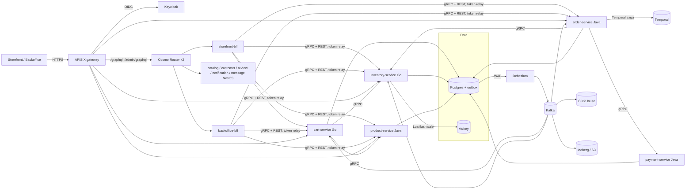
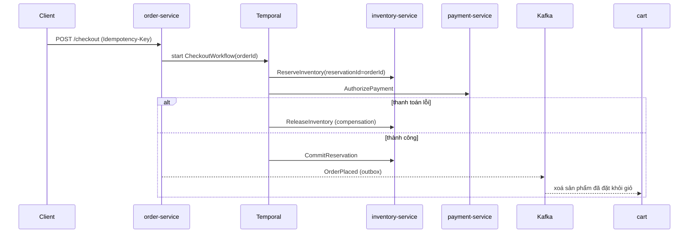

# Tổng quan kiến trúc

```mermaid
flowchart LR
  web[Storefront / Backoffice] -->|HTTPS| apisix[APISIX gateway]
  apisix -->|OIDC| kc[Keycloak]
  apisix -->|/graphql, /admin/graphql| router[Cosmo Router x2]
  router --> sbff[storefront-bff] & bbff[backoffice-bff]
  router --> nest[catalog / customer / review / notification / message NestJS]
  sbff & bbff -->|gRPC + REST, token relay| cart & inv & order & product
  apisix --> cart[cart-service Go] & inv[inventory-service Go] & order[order-service Java] & product[product-service Java]
  cart -->|gRPC| inv
  cart -->|gRPC| product
  order -->|Temporal saga| temporal[(Temporal)]
  order -->|gRPC| inv
  order -->|gRPC| payment[payment-service Java]
  subgraph data[Data]
    pg[(Postgres + outbox)]
    valkey[(Valkey)]
  end
  cart & inv & order & product & payment --> pg
  inv -->|Lua flash sale| valkey
  pg -->|WAL| dbz[Debezium] --> kafka[(Kafka)]
  kafka --> cart & inv & order
  kafka --> ch[(ClickHouse)] & lake[(Iceberg / S3)]
```

## Luồng checkout (mục tiêu sau đợt 2)

```mermaid
sequenceDiagram
  participant C as Client
  participant O as order-service
  participant T as Temporal
  participant I as inventory-service
  participant P as payment-service
  participant K as Kafka
  C->>O: POST /checkout (Idempotency-Key)
  O->>T: start CheckoutWorkflow(orderId)
  T->>I: ReserveInventory(reservationId=orderId)
  T->>P: AuthorizePayment
  alt thanh toán lỗi
    T->>I: ReleaseInventory (compensation)
  else thành công
    T->>I: CommitReservation
    O-->>K: OrderPlaced (outbox)
    K-->>cart: xoá sản phẩm đã đặt khỏi giỏ
  end
```

Chi tiết từng quyết định: `docs/adr`. Contract: `api/proto` (gRPC + event), `api/asyncapi`, `api/openapi`, `api/graphql`.
